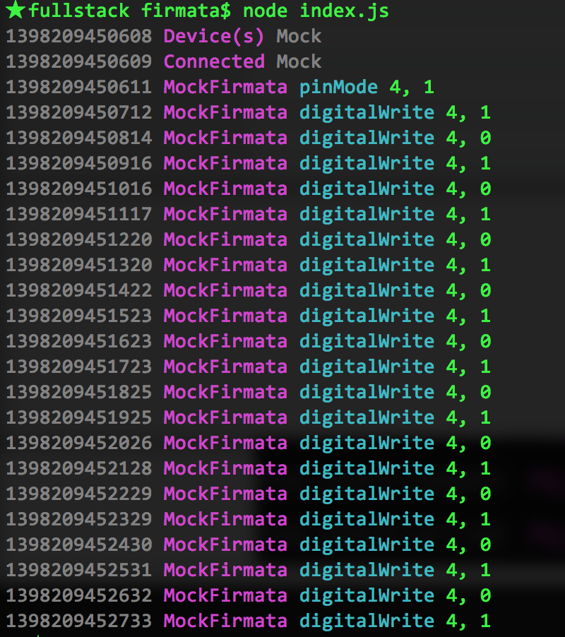

# [fit]Full Stack Firmata

### JSConf BR 2014

---

# [fit] Francis Gulotta
# @reconbot
# wizarddevelopment.com

---

# [fit] ❤ NodeBots


^ I ❤ nodebots

---

# [fit] ❤ Johnny-Five


---

Overview of why JS robots

# Make it really easy to make robots


___

> A blinking light is the hello world of robotics
-- Sara Chipps

___


```js


var five = require("johnny-five");
var board = new five.Board();

board.on("ready", function() {

  var led = new five.Led(13);
  led.strobe();

});


//Video Stolen from Rick Waldren
//github.com/rwaldron/johnny-five

```


---

> Isso é Foda
-- Francis

---

# What's happening here?

---

1. Johnny-Five looks for USB ports
1. Opens the first obvious one & listen for Arduino
1. Arduino starts up and says "Hello"
1. J5 sets pin 4 to output
1. J5 sets pin 4 to high
1. J5 sets pin 4 to low
1. J5 sets pin 4 to high
1. J5 sets pin 4 to low
... forever



---

# Johnny-Five's Default Stack

1. Node Firmata
2. Node-Serialport
3. Firmata/Arduino

---


---

# Johnny-Five's Default Stack

```js
var Firmata = require("firmata"),
  five = require("johnny-five");

var board = new five.Board({
  // default
  io: new Firmata.Board()
});

```

---
# Johnny-Five's Spying Stack

```js
var Firmata = require("firmata"),
  five = require("johnny-five");
  //stolen from j5
  MockFirmata = require("mock-firmata")
var board = new five.Board({
  // lets spy!
  io: new MockFirmata({debug:true})
});

```

---

Johnny-Five => Node Firmata => USB SERIAL => Arduino

