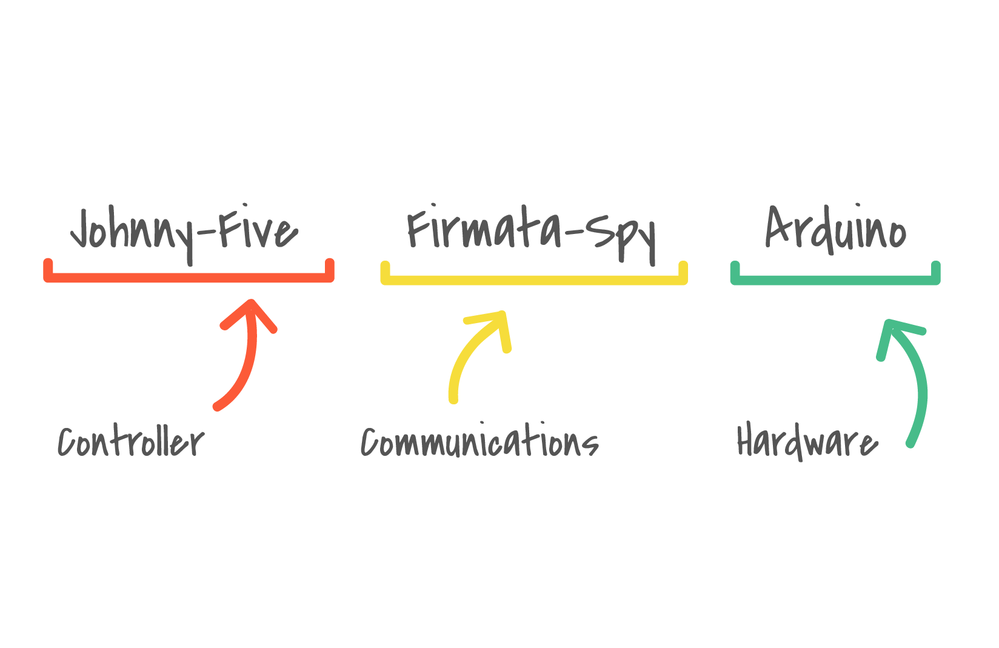

# [fit]Full Stack Firmata

### JSConf BR 2014

---

# [fit] Francis Gulotta
# @reconbot
# wizarddevelopment.com

---

# [fit] ❤ NodeBots


^ I ❤ nodebots

---

# What are NodeBots?

## NodeBots are robots that are controlled by node.js.


---

# What are NodeBots?

## Robots are inherently asynchronous. NodeJS & JavaScript makes async easy.
## Single threaded, turn based, non-blocking execution.

---


---


---


^ JSCONF 2013

---

# Robots Conf


---


---


---


---

# What's firmata anyway?

---

> Firmata is a generic protocol for communicating with microcontrollers from software on a host computer.
-- firmata.org (probably Jeff)

^ sometimes usb, bluetooth, xbee, wifi

---


^ Jeff took the firmata arduino project over a few years ago and made it a lot better. He needs C programmers with a will to help!

---
# Works in a lot of cool places
- Arduino
- Beagal Bone
- Raspberry Pi
- JS
- Ruby
- Python
- Go

---

# [fit] ❤ Johnny-Five


---

> Johnny-Five is a library of device drivers for the physical world. It's also jQuery for robots.
-- Francis

---

#Johnny-Five is...

- Johnny-Five is an Open Source, JavaScript Arduino programming framework, developed at Bocoup
- A library of modules for devices as small as buttons to as large as walking robots.
- Lots and lots of modules


---


---

> A blinking light is the hello world of robotics
-- Sara Chipps

---


```js


var five = require("johnny-five");
var board = new five.Board();

board.on("ready", function() {

  var led = new five.Led(4);
  led.blink();

});


//Video Stolen from Rick Waldren
//github.com/rwaldron/johnny-five

```


---

> Isso é Foda
-- Francis

---

# Let's go deeper

---


^ J5 by default expects firmata, but now can work with plugable backends for the begal bone, sparkcore and raspberry-pi

---

# Johnny-Five's Default Stack

```js
var five = require("johnny-five");
var Firmata = require("firmata");
var SerialPort = require('serial-port').SerialPort;

var board = new five.Board({
  // default and auto
  io: new Firmata.Board({
    port: new SerialPort()
  })
});

```

---



---

# Johnny-Five's Spying Stack

```js
var five = require("johnny-five");
var FirmataSpy = require("firmata-spy");

var board = new five.Board({
  // lets spy!
  io: new FirmataSpy({debug: true})
});

board.on("ready", function() {
  var led = new five.Led(4);
  led.blink();
});

```

---

1. Johnny-Five looks for USB serial ports
1. Opens the first obvious one & listen for Arduino
1. Arduino starts up and says "Hello"
1. J5 sets pin 4 to output
1. J5 sets pin 4 to high
1. J5 sets pin 4 to low
1. J5 sets pin 4 to high
1. J5 sets pin 4 to low
... forever


---

# Let's go deeper

---


---

# Firmata

### Composed of MIDI Messages

---
^ yes that midi


---

# Firmata

### Composed of MIDI Messages
### Passes data in 7bit encoding

---

# Firmata

### Composed of MIDI Messages
### Passes data in 7bit encoding
### Mostly MIDI complient

---


---


---

# Spying Tools

```js
// Knows how to parse and generate midi messages
var MidiParser = require('midi-parser');

// Knows how to use midi-parser to parse and
// generate firmata messages
var FirmataParser = require('firmata-parser');

// Pretends to be a serial port
var SerialSpy = require('serial-spy');


```

---

# First Step: The Handshake
# Second Step: Call the functions and see what happens.

---

# The Handshake

Happens when a firmata server talks to a firmata device. Determines what the device can do and if they are compatible. Only one version `v2.3`.

^ But lets go deeper

---

# Handshake

```js

var Board = require("firmata").Board;
var SerialSpy = require('serial-spy');

var serialSpy = new SerialSpy({debug:true});
var board = new Board(serialSpy, function(){
  console.log("ready to robot!");
});

```

^ if all goes well we'll be ready to robot

---

# Handshake

```js

var Board = require("firmata").Board;
var SerialSpy = require('serial-spy');

var serialSpy = new SerialSpy({debug:true});
var board = new Board(serialSpy, function(){
  console.log("ready to robot!");
});

```


---

# Not "ready to robot"
# Raw midi data isn't that useful


---

^ Firmata Parser to the rescue

# Handshake take 2

```js
var Board = require("firmata").Board;
var FirmataParser = require('firmata-parser');
var SerialSpy = require('serial-spy');

var serialSpy = new SerialSpy({debug:true});
var parser = new FirmataParser({debug:true});

serialSpy.on('write', function(data){
  parser.write(data);
});

var board = new Board(serialSpy, function(){
  console.log("ready to robot!");
});

```

---
# Handshake take 2

```js
var Board = require("firmata").Board;
var FirmataParser = require('firmata-parser');
var SerialSpy = require('serial-spy');

var serialSpy = new SerialSpy({debug:true});
var parser = new FirmataParser({debug:true});

serialSpy.on('write', function(data){
  parser.write(data);
});

var board = new Board(serialSpy, function(){
  console.log("ready to robot!");
});

```


---

# Node Firmata is asking for:

## Protocol Version

## Firmware Information

---

# Handshake Take 3

```js

var Board = require("firmata").Board;
var FirmataParser = require('firmata-parser');
var SerialSpy = require('serial-spy');

var serialSpy = new SerialSpy({debug:true});
var parser = new FirmataParser({debug:true});

serialSpy.on('write', function(data){
  parser.write(data);
});

var board = new Board(serialSpy, function(){
  console.log("ready to robot!");
});

serialSpy.emit('data', FirmataParser.firmataVersion());
serialSpy.emit('data', FirmataParser.firmwareVersion("spy"));

```

---

# Handshake Take 3

```js

var Board = require("firmata").Board;
var FirmataParser = require('firmata-parser');
var SerialSpy = require('serial-spy');

var serialSpy = new SerialSpy({debug:true});
var parser = new FirmataParser({debug:true});

serialSpy.on('write', function(data){
  parser.write(data);
});

var board = new Board(serialSpy, function(){
  console.log("ready to robot!");
});

serialSpy.emit('data', FirmataParser.firmataVersion());
serialSpy.emit('data', FirmataParser.firmwareVersion("spy"));

```


^ We got 3 things going on here. Firmata sent a bunch of reporting commands both analog and digital, and we have a capability query.

---

# Digital Reporting
When enabled on a pin firmata will report the digital value (0,1) of this pin when it changes.

# Analog Reporting
When enabled on a pin firmata will report the analog value (0-65535) if it changes between  19ms polls (this is up to the client).

---

# Capability Query

These queries are intended to allow GUI-based programs to discover the capabilities and current state of any board running Firmata. The idea is to facilitate displaying highly accurate on-screen representation of the board

The capabilities response provides a list of all modes supported by all pins, and the resolution used by each mode.

---

# Handshake Take 4

```js
var Board = require("firmata").Board;
var FirmataParser = require('firmata-parser');
var SerialSpy = require('serial-spy');

var serialSpy = new SerialSpy({debug:true});
var parser = new FirmataParser({debug:true});

serialSpy.on('write', function(data){
  parser.write(data);
});

var board = new Board(serialSpy, function(){
  console.log("ready to robot!");
});

serialSpy.emit('data', FirmataParser.firmataVersion());
serialSpy.emit('data', FirmataParser.firmwareVersion("spy"));

var pins = [{digital: true}];
serialSpy.emit('data', FirmataParser.capabilityResponse(pins));
```

^ Lets pretend we have a digital pin

---

# Handshake Take 4

```js
var Board = require("firmata").Board;
var FirmataParser = require('firmata-parser');
var SerialSpy = require('serial-spy');

var serialSpy = new SerialSpy({debug:true});
var parser = new FirmataParser({debug:true});

serialSpy.on('write', function(data){
  parser.write(data);
});

var board = new Board(serialSpy, function(){
  console.log("ready to robot!");
});

serialSpy.emit('data', FirmataParser.firmataVersion());
serialSpy.emit('data', FirmataParser.firmwareVersion("spy"));

var pins = [{digital: true}];
serialSpy.emit('data', FirmataParser.capabilityResponse(pins));
```


---

#Analog Mapping Query

The analog mapping query provides the information about which pins (as used with Firmata's pin mode message) correspond to the analog channels.

For example;
`A5 => 14`
`A4 => 15`

---

# Handshake take 5

```js
var Board = require("firmata").Board;
var FirmataParser = require('firmata-parser');
var SerialSpy = require('serial-spy');

var serialSpy = new SerialSpy({debug:true});
var parser = new FirmataParser({debug:true});

serialSpy.on('write', function(data){
  parser.write(data);
});

var board = new Board(serialSpy, function(){
  console.log("ready to robot!");
});

serialSpy.emit('data', FirmataParser.firmataVersion());
serialSpy.emit('data', FirmataParser.firmwareVersion("spy"));

var pins = [{digital: true, analog: true}];
serialSpy.emit('data', FirmataParser.capabilityResponse(pins));
serialSpy.emit('data', FirmataParser.analogMappingResponse(pins));

```

^ Now lets pretend we have an a1 pin that is also pin 1 and send our analogMappingResponse

---

# Handshake take 5

```js
var Board = require("firmata").Board;
var FirmataParser = require('firmata-parser');
var SerialSpy = require('serial-spy');

var serialSpy = new SerialSpy({debug:true});
var parser = new FirmataParser({debug:true});

serialSpy.on('write', function(data){
  parser.write(data);
});

var board = new Board(serialSpy, function(){
  console.log("ready to robot!");
});

serialSpy.emit('data', FirmataParser.firmataVersion());
serialSpy.emit('data', FirmataParser.firmwareVersion("spyware"));

var pins = [{digital: true, analog: true}];
serialSpy.emit('data', FirmataParser.capabilityResponse(pins));
serialSpy.emit('data', FirmataParser.analogMappingResponse(pins));

```


---

#[fit] READY TO ROBOT!

---

# Full Handshake Sequence
 - Ask for version and firmware
 - Give version # and firmware
 - Ask for Pin Capabilities
 - Give Pin Capabilites
 - Ask for Analog Mapping
 - Give Analog Mapping

---

# Call the functions and see what happens

^ back to blink

---

```js
// Same as before but
// respond with 8 fake pins
...

board.pinMode(4,1);
board.digitalWrite(4, 1);
board.digitalWrite(4, 0);
board.digitalWrite(4, 1);
board.digitalWrite(4, 0);

```


^ Look at those bytes that j5 caused to send!

---

# When you string everything together...

---
# J5 with Serial Spy

```js
// firmata board from previous
var j5Board = new five.Board({
  // lets spy!
  io: board,
  debug: true,
  repl: false
});

var led = new five.Led(4);
led.blink();

```


---

# Let's go deeper!

---


^ We know it's getting the serial data from firmata but we don't know what it's doing

---

# Firmata-Arduino

---

# standardFirmata.ino

---
# standardFirmata.ino
- Loaded on many arduinos by default.
- Knows how to handshake and provides all default functionality
- Has lots of friends for when you have special needs servoFirmata, configurableFirmata, AnalogFirmata

---

# standardFirmata.ino

```c
void setup()
{
  Firmata.setFirmwareVersion(FIRMATA_MAJOR_VERSION, FIRMATA_MINOR_VERSION);

  Firmata.attach(ANALOG_MESSAGE, analogWriteCallback);
  Firmata.attach(DIGITAL_MESSAGE, digitalWriteCallback);
  Firmata.attach(REPORT_ANALOG, reportAnalogCallback);
  Firmata.attach(REPORT_DIGITAL, reportDigitalCallback);
  Firmata.attach(SET_PIN_MODE, setPinModeCallback);
  Firmata.attach(START_SYSEX, sysexCallback);
  Firmata.attach(SYSTEM_RESET, systemResetCallback);

  Firmata.begin(57600);
  systemResetCallback();  // reset to default config
}
```

^ this is the magic, I don't know c worth a dam but this is easy to read

---

# standardFirmata.ino Digital Write

```c
void digitalWriteCallback(byte port, int value)
{
  byte pin, lastPin, mask=1, pinWriteMask=0;

  if (port < TOTAL_PORTS) {
    // create a mask of the pins on this port that are writable.
    lastPin = port*8+8;
    if (lastPin > TOTAL_PINS) lastPin = TOTAL_PINS;
    for (pin=port*8; pin < lastPin; pin++) {
      // do not disturb non-digital pins (eg, Rx & Tx)
      if (IS_PIN_DIGITAL(pin)) {
        // only write to OUTPUT and INPUT (enables pullup)
        // do not touch pins in PWM, ANALOG, SERVO or other modes
        if (pinConfig[pin] == OUTPUT || pinConfig[pin] == INPUT) {
          pinWriteMask |= mask;
          pinState[pin] = ((byte)value & mask) ? 1 : 0;
        }
      }
      mask = mask << 1;
    }
    writePort(port, (byte)value, pinWriteMask);
  }
}
```

---
# From the bottom up
 1. Arduino: `digitalWrite()`
 1. Firmata (protocol): `digitalMessage`
 1. Node-Firmata: `digitalWrite()`
 1. Johnny-Five: `led.blink()`

---

#[fit]Lets go bigger!

---


---

```js
var ED = require('johhny-five/eg/ed.js');
var ed209 = new ED({
  // assign servos
  right: {
    hip: 9,
    foot: 11
  },
  left: {
    hip: 10,
    foot: 12
  }
});

// Stand upright!
ed209.attn();

// Walk forward!
ed209.fwd();

// Code and video from Johnny-Five
// and Rick Waldren

```


---


---

> You can start coding your robot today

---

# Want to learn more?

 - nodebots.io
 - github.com/rwaldron/johnny-five
 - github.com/firmata/arduino
 - github.com/reconbot/firmata-parser
 - github.com/reconbot/firmata-spy

---

# Find a meetup or start your own!

- NodeBots Guatemala - Guatemala
- NodeBots Medellín - Colombia
- NodeBots Villavicencio - Colombia
- NodeBots of London - UK
- NodeBots NYC - USA
- NodeBots SF - USA

---

# NodeBots Fortaleza?
# NodeBots Rio de Janeiro?
# NodeBots São Paulo?

---

# NodeBots Fortaleza?
# NodeBots Rio de Janeiro?
# NodeBots São Paulo?

#[fit] github.com/nodebots/www/pulls

---

#[fit] THANK YOU!
# Francis Gulotta
# @reconbot
# wizarddevelopment.com

---

#[fit] github.com/reconbot/fullstack-firmata

